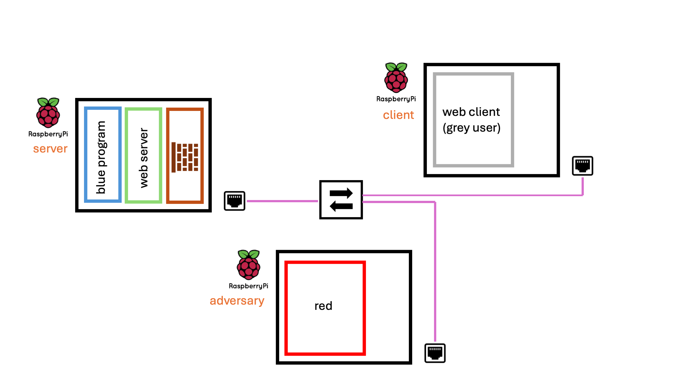
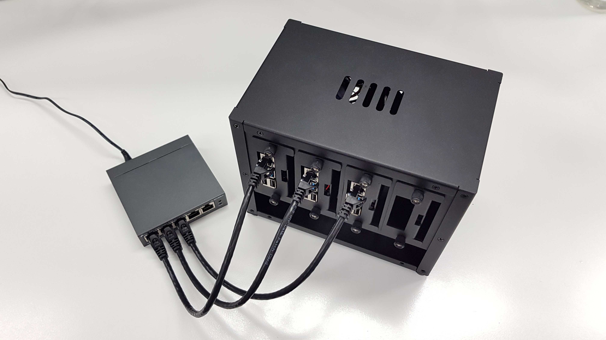
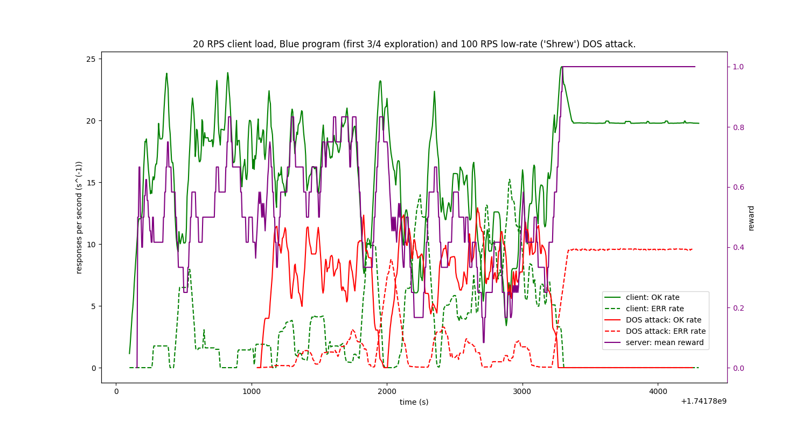

# R<sup>3</sup>ACE - *Replicable* and *Reproducible* *Real-World* Autonomous Cyber Environments

## Motivation
Existing cyber environments **incorporating low fidelity models and high levels of abstraction** <sub>[1],[2]</sub>, are valuable for exploring more fundamental research problems in autonomous cyber defence (ACD), such as task and entity generalisation.

However, **there remain concerns about the _reality-gap_ between cyber environments and real-world cyber-systems** <sub>[3]</sub>. 

Environments attempting to close the reality-gap have been varied in their approach, robustness and public availability <sub>[4],[5]</sub>.

Moreover, **the decision problems presented by the more realistic environments that are currently available, are extremely challenging**. It is complex both to make progress and to measure it. In these environments **research faces the complexity of realism _combined_ with scale**.

### Contributions to Autonomous Cyber Defence (ACD) research:
1. Explore the challenges of realism, without the challenge of scale - focusing on **_replicability_** and _**reproducibility**_.
2. Specifically, train and evalutate ACD agents against **_continuous-time_**, **_conurrently-running_** cyber systems. This is a departure from cyber environments that expose discrete-time, turn-based finite state machines.
3. Investigate both **_physical_** and **_virtual_** systems, with _**accessible**_ and _**reproducible**_ infrastructure.

# Overview
## Objectives
1. Make publicly accessible a real-world cyber environment that models a **_minimum viable cyber system_** - _minimum_ in it's scale and complexity; prioritising **_replicability_**, **_reproducibility_** and **_public accessibility_**.
2. Define a simple decision problem using the R<sup>3</sup>ACE infrastructure, providing a reference implementation.

## A **_minimum viable cyber system_**
Our design for a **_minimum viable cyber system_** (there are surely others) consists of 3 machines networked together via a switch.



Central to the task of evaluating the defence of a cyber system is a consensus on it's **_utility_** - the value or service that the system provides, upon which stakeholders depend. Simulating this utility is an important and challenging task in the design of cyber environments.

We propose that **one of the machines, the '_web client_', finds utility in receiving OK (status code = 200) responses** to GET requests it sends to another machine, the '_web server_'. The third machine, the '_adversary_' has the objective of carrying out a successful cyber attack. **An attack is deemed successful if the _utility_ of the system is comprimised**, i.e. the _web client_ does not receive OK (status code = 200) responses to GET requests sent to the _web server_.

The system can be instantiated with either physical hardware (e.g. a network of Raspberry Pi's) or virtualised hardware.



## A Simple Decision Problem
### Scenario
The _web client_ sends a stream of GET requests at a **constant rate**, $R$. The _adversary_ carries out a Denial-of-Service (DOS) attack.
And a 'blue agent' (the `blue` program, see [Reference Implementation](#reference-implementation) section below), is running on the _web server_ machine with the objective of ensuring that _web client_ GET requests receive OK (status code = 200) responses.

### Decision Problem
The blue agent has access to the following information:
- The _web client_ request rate, $R$.
- The average rate of OK (status code = 200) responses received by the _web client_.
- The IP addresses of the other two machines in the network, **though it is not know which machine is the _adversary_**.
- A list of the IP addresses on the firewall blocklist. Requests to the HTTP server (on the _web server_ machine) from these IP addresses are blocked by the system firewall - they do not reach the HTTP server.

The blue agent is able to execute the followingactions:
- Add or remove IP addresses from the _web server_ blocklist.
- Do nothing.

### Evaluation
The agent is evaluated against the cumulative number of OK (status code = 200) responses received by the _web client_, as a fraction of the total number of requests made by the _web client_.

### TL;DR
The blue agent knows the current rate of OK responses received by the client and must figure out which of the two IP addresses belongs to the _web client_, blocking the other IP address which belongs to the adversary.

## Reference Implementation
The reference implementation implements the decision problem described above, on R<sup>3</sup>ACE infrastructure. The following software components have been developed:
- [`serving`](https://github.com/edchapman88/serving) (HTTP server): An executable running on the _web server_ machine, responding to GET requests with OK (status code = 200) responses.
- [`getting`](https://github.com/edchapman88/getting) (HTTP client): An executable running on the _web client_ machine, sending GET requests to the HTTP server at a constant rate and emmitting a signal whenever an OK (status code = 200) response is received.
- [`blue`](https://github.com/edchapman88/blue) (blue agent): An executable running on the _web server_ machine, managing the HTTP server blocklist, and parsing the signal emmited by the _web client_ to evaluate the current average rate of OK responses.
- [`policy-server`](https://github.com/edchapman88/policy-server) (Python policy server): A Python HTTP server that can be used to run Python policies against the R3ACE environment. For ease, this repo implements the OpenAI gymnasium interface for training RL agents.
- [`got`](https://github.com/edchapman88/got) (analysis): A repository with a library of helper functions for parsing and plotting the log files written by the above executables. A catalogue of experiments (each with a `.ipynb` notebook, plots and some basic analysis) serve as a reference point for designing, running and analysing experiments.
- [`eyes`](https://github.com/edchapman88/eyes) (parsing): A dependency of `got`, a library of types and parsing functions. The `got` [README](https://github.com/edchapman88/got/blob/main/README.md) describes how to install `eyes` as a dependency.

It is also necessary to **extend the R<sup>3</sup>ACE infrastructure** for this decision problem, to provide an _out-of-band_ communication channel between the _web client_ machine and the _web server_ machine. This enables the `blue` program to receive the OK response signals emmited by the _web client_, _reliably_, even during a successful attack launched by the _adversary_.

In this reference implementation the _out-of-band_ channel of communication is provided by:
- For the physical infrastructure: a wired serial connection (using a [Null Modem cable](https://en.wikipedia.org/wiki/Null_modem)).
- For the virtual infrastructure: a UDP connection **on a seperate private LAN**, isolated from the main R<sup>3</sup>ACE network.

As such, the `getting` software and the `blue` software support both serial and UDP protocols for emmiting and receiving information on the _out-of-band_ channel.

Below is an example plot, generated by an R3ACE experiment. A basic policy solves the decision problem described above. After a period of exploration the policy correctly keeps the _adversary_ in the firewall blocklist, allowing requests from the _web client_ through to the HTTP server. The [`got`](https://github.com/edchapman88/got) library was used for parsing and plotting the information in the log files gathered from the environment.


# Quick Questions
## How is this different to other Cyber Environments?
In contrast with 'AI Gym' environments, such as those available in the [OpenAI/gym](https://github.com/openai/gym) project <sub>[6]</sub>, **_R<sup>3</sup>ACE_** does **not** expose a turn-based API (e.g. the environment, a finite state machine, 'waits' while the policy computes an action, after which the environment is 'stepped' forwards to the agents next turn).

> [!IMPORTANT]
> **_R<sup>3</sup>ACE_ is a real computer network** (cyber infrastructure) with a cyber defence software program, `blue`, running on one of the machines.

### The [`blue`](https://edchapman88.github.io/blue/blue/index.html) program
This software:
1. Fetches information from the cyber system (the surrounding compute network).
2. Uses a policy to decide what (if any) action to take.
3. Executes this action, causing a side effect in the cyber system (e.g. an IP address is added to a block list).

### The [`markov`](https://edchapman88.github.io/blue/markov/index.html) library
The above design for a program should infact be useful for the application of ACD to **many** _realistic_, or indeed _real-world_ cyber systems. As such, we have **designed and documented an abstract software interface**, the [`markov`](https://edchapman88.github.io/blue/markov/index.html) library, to _generalise_ over different cyber systems and policies.

## How do you train or evaluate policies?
In **_R<sup>3</sup>ACE_**, a policy is a software implementation of the [`RLPolicyType`](https://edchapman88.github.io/blue/markov/markov/Markov/Agent/module-type-RLPolicyType/index.html) interface. This interface is one of the building blocks that make up the modular software interface for the `blue` program.

At present, two policies are implemented and the Command Line Interface (CLI) for the `blue` program determines which policy is used. One of the policy implementations, the [`ServerPolicy`](https://edchapman88.github.io/blue/blue/blue/Blue/ServerPolicy/index.html), makes HTTP requests to a policy server running elsewhere (e.g. on the same machine, or another machine on the same network). This may be useful for defining and running policies in another language, e.g. Python. **We have developed a Python policy server ([`policy-server`](https://github.com/edchapman88/policy-server)) that exposes the R3ACE environment as an OpenAI gymnasium environment.**

Training or evaluation occurs when the cyber system is running (all network hosts are up with applications running, e.g. servers, clients, logging daemons) **and** the `blue` program is running (with an embedded policy, as discussed). The distinction between training and evaluation comes down to whether or not the policy implementation is 'self-optimising' at that point in time (e.g. the program mutating the policy based on the rewards returned by the reward function).

# Getting Started
You could get started in a number of ways. In order of increasing ambition:
1. Run the [reference implementation](#reference-implementation) (with the basic policy provided), against the [Simple Decision Problem](#a-simple-decision-problem) to **reproduce** the plot above.
2. Use the reference implementation and the Simple Decision Problem as a Cyber Environment: **Develop new agent policies**, train and evaluate against **different cyber attacks**.
3. **Design a more complex decision problem** on the R<sup>3</sup>ACE _minimum viable system_. Implement the required functionality (perhaps new observations or actions). Train agents to solve this problem.
4. Inspired by the R<sup>3</sup>ACE approach to _Replicable_ and _Reproducible_ _Real-World_ Cyber Environments, design an alternative cyber system, perhaps **increasing the scale or complexity of the infrastructure**. 

# Set Up R<sup>3</sup>ACE Infrastructure - Physical or Virtual
## How are the machines **_reproducibly_** configured?
The machines run [NixOS](https://nixos.org/) <sub>[7]</sub>, a Linux distribution based on the Nix package management system <sub>[8]</sub>. Producing _"reproducible, declarative and reliable systems"_ is central to Nix's design.

**This repository contains operating system (OS) declaration files for each of the 3 machines.** These OS configurations can be reproducibly installed onto both physical and virtual machines.

Find out more about NixOS at [nixos.org](https://nixos.org/), or see some quick tips at [`./docs/nixos-tips.md`](docs/nixos-tips.md): which includes tips on **packaging your own software as a Nix Package**, making it installable onto one of the NixOS machines.

**_TL;DR:_** An OS is declared with a `flake.nix` file, but most of the OS configuration can be found in a `configuration.nix` file, which is imported by the `flake.nix` file. In short, the two files together with any other anxillary documents (SSL certificates, config files for programs to be run on the machines, etc.) make up the full configuration of each machine.

## Using physical infrastructure: Raspberry Pis
To install a configuration onto a Raspberry Pi Model 4B, following these steps:
1. Log on to a development machine (Linux or MacOS), i.e. not the target Raspberry Pi. This machine must have an SD reader (use an SD card reader USB dongle).
2. Download the latest release of NixOS as an SD card image from [here](https://hydra.nixos.org/job/nixos/trunk-combined/nixos.sd_image.aarch64-linux) (or instead select a particular release version).
3. Insert the Raspberry Pi's SD card and identify the path to the card (e.g. something like /dev/sda on Linux or /dev/disk4 on MacOS). On MacOS, running `diskutil list` can help to find the SD card device.
4. Decompress the SD card image with `unzstd <the downloaded image.zst>`.
5. Flash the image onto the SD card with `sudo dd if=<path to decompressed sd image (a .img file)> of=<path to SD card (e.g. /dev/sda)> bs=4096 conv=fsync status=progress`.
6. Insert the SD card into the Raspberry Pi and boot the device with a display (via the mini HDMI port) and keyboard connected. The Pi will boot into the `nixos` user, which has password-less `sudo` privileges.

**Carry out the following steps on the Raspberry Pi:**

7. On the Pi, create a new user with `sudo useradd <new username>`. For convenience, this username should match a user configured in the desired `configuration.nix` file that will be copied to the Raspberry Pi later (e.g. one of the `configuration.nix` files in this repo).
8. Add a password for that user with `sudo passwd <new username>`.
9. Run `nixos-generate-config` to generate two files: `/etc/nixos/configuration.nix` and `/etc/nixos/hardware-configuration.nix`.
10. Shutdown the device with `sudo shutdown`.

**Carry out the folling steps on a seperate Linux machine:**

11. Insert the SD card, and navigate to the `NIXOS_SD` partition of the SD card, which is the Linux file system.
12. Replace the auto-generated `configuration.nix` file with the desired replacement - **the replacement should be edited to ensure the `system.stateVersion` number matches that of the auto-generated file**, this is the NixOS release version.
13. Do **not** replace the `hardware-configuration.nix` file.
14. Add any other required files to `/etc/nixos`, e.g. a `flake.nix` file, or a certificate for a certificate authority that is referenced in `configuration.nix` (this is the case with `kleene` in this repo).

**Carry out the following steps on the Raspberry Pi:**

15. Insert the SD card and boot.
16. Configure a (temporary) Wifi connection:
```sh
sudo systemctl start wpa_supplicant 
```
followed by
```sh
wpa_cli
```
to configure the interface
```
> add_network
```
(Which tells you which network you've added; in my case `0`.)
```
> set_network 0 ssid "MY WIFI"
OK
> set_network 0 psk "NETWORK PASSWORD"
OK
> enable_network 0
OK
<3>CTRL-EVENT-SCAN-STARTED
<3>CTRI-EVENT-SCAN-RESULTS
<3>Trying to associate with SSID 'MY WIFI'
<3>Associated with xx:xx:xx:xx:xx:xx
... some other stuff
> save_config
OK
```
17. Test the new configuration before switching into it with: `sudo nixos-rebuild test`. **This will likely throw an error. See below.**
- If using a `flake.nix`, the configuration targets a certain hostname, described by `nixosConfigurations."<hostname>".<etc..>`.
- This hostname must match the system hostname at the time of running `nixos-rebuild` commands.
- The hostname will be `nixos` until changed.
- The system hostname is changed by setting the `networking.hostName = "<new hostname>";` property in the `configuration.nix` file.
- **Workaround**: Set the desired new hostname in `configuration.nix`, build the configuration for the current hostname (`nixos`), by setting that in `flake.nix`.
- After the first reboot the system hostname will have been updated to the new hostname.
- Future configurations must now be built for the new hostname, by updating the value in `flake.nix`.

## Using virtual infrastructure
As an alternative to booting NixOS on physcial hardware, virtual machine (VM) images or 'virtual disks' (with OS pre-installed) can be built from the NixOS config files and the network between the machines can be virtualised.

**Pre-built aarch64 _VMWare_ VM disks are available [here](https://zenodo.org/records/15147272) for the 3 machines in this project.** 

These VMs should run with minimal set-up when hosted on a laptop or PC with an ARM processor e.g. ARM-linux, or MacOS with Apple Silicon chips (M1, M2, ...).

[`./docs/building-vm-images.md`](docs/building-vm-images.md) includes details about building VM images and virtual disks (such as the pre-built _VMWare_ VM disks made available). In principal, the software used to build the images ([`nixos-generators`](https://github.com/nix-community/nixos-generators)) also supports building images for many other platforms: _VirtualBox_, _Amazon EC2_, _Docker_, _Azure_ - though building for these platforms has not been tested during this project.

### Tutorial for MacOS
1. Download VMWare Fusion Pro 13 (available for free). Either [directly from Broadcom](https://www.vmware.com/products/desktop-hypervisor/workstation-and-fusion) (requires making an account with Broadcom), or [via HomeBrew](https://formulae.brew.sh/cask/vmware-fusion) (easier download and installation with `brew install --cask vmware-fusion`).
2. Create a 'host-only' private LAN network within VMWare across which the guest VMs will be able to communicate:
    - Open VMWare.
    - Go to the application settings.
    - Open the 'Network' tab.
    - Add a new custom network with the `+` button.
    - _*Disable*_ the box `Allow virtual machines on this network to connect to external networks (using NAT)`. We do not want to allow the guest VMs to be connected to the external networks that your host machine is connected to.
    - _*Disable*_ the box to `Connect the host Mac to this network`.
    - _*Enable*_ the box to `Provide addresses on this network via DHCP`.
    - Enter the `Subnet IP`: `172.0.0.0`.
    - Enter the `Subnet Mask`: `255.255.255.0`.
    - Leave `MTU`: `System Configuration`.
    - Double-click on the name of the network to change it to `r3ace`.
    - Click `Apply`.
    - Now _*Disable*_ `Provide addresses on this network via DHCP`. The setting for the `Subnet IP` and `Subnet Mask` with go grey but remain configured with the values above. This is important.
    - Click `Apply` again.
3. Create another private network that will be shared between only the '_web client_' and '_web_server_'. This network, isolated from the first, will be an _out-of-band_ communication channel between the client and server. To do so, repeat step two with the following differences:
    - Enter the `Subnet IP`: `172.0.1.0`.
    - Name the network `r3ace-udp`.
Follow all of the other steps, as before, in sequence.
4. Create a third private network that will enable us to send requests from the VM host to the VMs, or open SSH connections to them. The VMs may be disconnected from this network at a later date to 'air-gap' the VMs from your host Mac for safety (e.g. running experiments involving harmful software). To do so, repeat step two with the following differences:
    - _*Enable*_ the box to `Connect the host Mac to this network`.
    - Enter the `Subnet IP`: `172.0.2.0`.
    - Name the network `ssh`.
6. Create a new virtual machine from a pre-built VM disk of your choice. It's recommended to setup `hilbert` first, because the networking can be tested by making HTTPS requests to the web server installed on the `hilbert` VM disk.
    - Open VMWare and click the `+` icon to create a new VM.
    - Click `Create a custom virtual machine` and the `Continue`.
    - For `Choose Operating System`, pick `Other` and `Other 64-bit arm` and `Continue`.
    - Select `Use an existing virtual disk`, then click `Choose virtual disk...` to select the VM disk file. This should be a file with a `.vmdk` file extension. Ensure that `Make a seperate copy of the virtual disk` is selected. Click `Continue`.
    - Click `Customize Settings` to bring up the setting for the VM once it has been created. Choose an appropriate name for the new VM and click `Save` to create it.
7. Adjust the setting of the newly created VM:
    - Under `Processors and Memory`, allocate appropriate resources to the VM guest (e.g. If you have an 8-core M1 Mac with 32Gb of RAM then perhaps allocate 2 cores to the VM, and 4Gb of memory).
    - Under `Network Adapter` ensure that appropriate network(s) are selected. `post` should be connected to **only** the `r3ace` network; `hilbert` and `kleene` to **both** the `r3ace` network **and** the `r3ace-udp` network.
    - VMs can be connected to the `ssh` network during setup (if necessary) so that `ssh` and `scp` can be used between the VM host and the VMs.
    - Before booting for the first time, enter the correct mac address for each network adapter. The mac addresses are configured in the `Advanced options` drop down of the setting for each network adapter. The mac addresses for each VM and each network adapter are as follows:

|  | `r3ace` | `r3ace-udp` | `ssh` |
| - | ------- | ---------- | ------ |
| `hilbert` | `02:00:00:00:03:00` | `02:00:00:00:03:01` | `02:00:00:00:03:02` |
| `kleene` | `02:00:00:00:02:00` | `02:00:00:00:02:01` | `02:00:00:00:02:02` |
| `post` | `02:00:00:00:04:00` | n/a | `02:00:00:00:04:02` |

8. Boot the VM.
9. The users setup on each vm are as follows:

| | username | password |
| - | ------ | -------- |
| `hilbert` | `blue` | `changeme` |
| `kleene` | `green` | `changeme` |
| `post` | `red` | `changeme` |

10. Once logged-in new passwords can be set for all users.

# References
[1] “Cyber Operations Research Gym.” 2022.
<https://github.com/cage-challenge/CybORG>; GitHub.

[2] Andrew, Alex, Sam Spillard, Joshua Collyer, and Neil Dhir. 2022.
“Developing Optimal Causal Cyber-Defence Agents via Cyber Security
Simulation.” In *International Confernece on Machine Learning (ICML)*.

[3] Andrew Lohn, Ant Burke, Anna Knack, and Krystal Jackson. 2023.
“Autonomous Cyber Defence: A Roadmap from Lab to Ops.” CETaS Research
Reports.

[4] Oesch, Sean, Amul Chaulagain, Brian Weber, Matthew Dixson, Amir
Sadovnik, Benjamin Roberson, Cory Watson, and Phillipe Austria. 2024.
“Towards a High Fidelity Training Environment for Autonomous Cyber
Defense Agents.” In *Proceedings of the 17th Cyber Security
Experimentation and Test Workshop*, 91–99. CSET ’24. New York, NY, USA:
Association for Computing Machinery.
<https://doi.org/10.1145/3675741.3675752>.

[5] Hammar, Kim, and Rolf Stadler. 2023. “Digital Twins for Security
Automation.” In *NOMS 2023-2023 IEEE/IFIP Network Operations and
Management Symposium*, 1–6.
<https://doi.org/10.1109/NOMS56928.2023.10154288>.

[6] Brockman, Greg, Vicki Cheung, Ludwig Pettersson, Jonas Schneider, John
Schulman, Jie Tang, and Wojciech Zaremba. 2016. “OpenAI Gym.”


[7] DOLSTRA, EELCO, ANDRES LÖH, and NICOLAS PIERRON. 2010. “NixOS: A Purely
Functional Linux Distribution.” *Journal of Functional Programming* 20
(5–6): 577–615. <https://doi.org/10.1017/S0956796810000195>.

[8] Dolstra, Eelco, Merijn de Jonge, and Eelco Visser. 2004. “Nix: A Safe
and Policy-Free System for Software Deployment.” In *Proceedings of the
18th USENIX Conference on System Administration*, 79–92. LISA ’04. USA:
USENIX Association.
